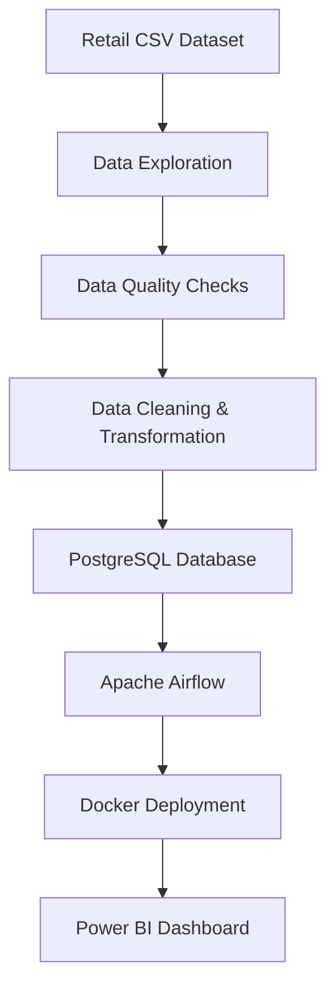

# 🛒 Retail Data Engineering Pipeline

<div align="center">


<br>


</div>

---

# 📖 Project Overview

This project demonstrates the complete lifecycle of a modern Data Engineering Pipeline using a Retail Sales Dataset.

The pipeline performs:

✅ Data Exploration

✅ Data Quality Validation

✅ Data Cleaning & Transformation

✅ PostgreSQL Data Storage

✅ Airflow Workflow Automation

✅ Docker Containerization

✅ Power BI Reporting

---

# 🚀 Project Architecture



---

# 🏗️ Technology Stack

| Layer | Technology |
|---------|-------------|
| Programming | Python |
| Data Processing | Pandas |
| Database | PostgreSQL |
| Orchestration | Apache Airflow |
| Containerization | Docker |
| Visualization | Power BI |
| Version Control | GitHub |

---

# 👥 Team Structure

## 👨‍💻 Member 1 — Data Engineer

### Responsibilities

- Data Exploration
- Data Profiling
- Data Quality Validation
- Dirty Data Generation
- Data Cleaning
- ETL Development
- PostgreSQL Integration

### Tools

```text
Python
Pandas
PostgreSQL
GitHub
```

---

## 👨‍💻 Member 2 — Platform Engineer

### Responsibilities

- Docker Setup
- Docker Compose
- Apache Airflow Setup
- DAG Development
- Workflow Automation
- Power BI Dashboard
- Deployment

### Tools

```text
Docker
Apache Airflow
Power BI
GitHub
```

---

# 🔄 Workflow

```text
Week 1
├── Data Exploration
├── Data Quality Assessment
└── Docker & Airflow Learning

Week 2
├── Data Cleaning
├── PostgreSQL Setup
└── Docker Environment

Week 3
├── ETL Development
├── Database Loading
└── Airflow DAG Development

Week 4
├── Pipeline Automation
├── Docker Integration
└── Testing

Week 5
├── Power BI Dashboard
├── Documentation
├── GitHub Repository
└── Final Presentation
```

---

# 📂 Project Structure

```text
RETAIL_DATA_ENGINEERING_PIPELINE
│
├── airflow/
│
├── data/
│   ├── SampleSuperStore.csv
│   └── SampleSuperStore_Dirty.csv
│
├── docs/
│
├── scripts/
│   ├── explore_data.py
│   ├── data_quality.py
│   └── create_dirtydata.py
│
├── sql/
│
├── README.md
└── .gitignore
```

---

# 📊 Data Quality Checks

The pipeline validates:

- Missing Values
- Duplicate Records
- Negative Values
- Outliers
- Invalid Categories
- Data Type Issues

Example Dirty Data Added:

```python
Missing Values
Duplicate Records
Negative Sales
Negative Profit
Invalid Categories
Outliers
```

---

# 🐳 Docker Integration

Docker will be used to containerize:

```text
PostgreSQL
Apache Airflow
ETL Environment
```

Benefits:

- Consistent Environment
- Easy Deployment
- Reproducible Pipelines

---

# ⚡ Apache Airflow

Airflow will orchestrate:

```text
Extract Data
    ↓
Quality Check
    ↓
Transform Data
    ↓
Load PostgreSQL
    ↓
Generate Reports
```

---

# 📈 Power BI Dashboard

Dashboard Features:

📊 Sales Analysis

📈 Profit Trends

🌎 Regional Performance

🏷️ Category Performance

👥 Customer Segmentation

---

# 🎯 Expected Outcomes

✔ Industry-Level Data Pipeline

✔ Automated ETL Workflow

✔ Dockerized Environment

✔ PostgreSQL Data Warehouse

✔ Power BI Reporting Dashboard

✔ Airflow Orchestration

---

# 📚 Learning Outcomes

- Data Engineering Fundamentals
- ETL Development
- PostgreSQL Administration
- Apache Airflow
- Docker
- GitHub Collaboration
- Dashboard Development

---

<div align="center">

### ⭐ If you like this project, give it a Star ⭐


</div>
