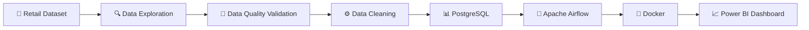

<div align="center">

#  🛒 RETAIL DATA ENGINEERING PIPELINE 🚀


<br>


</div>

---

## 🔥 Tech Stack

<div align="center">


</div>

---

# 🎯 Project Goal

Build a complete enterprise-grade Retail Data Engineering Pipeline that:

✨ Validates Data Quality

✨ Performs ETL Processing

✨ Loads Data into PostgreSQL

✨ Automates Pipelines using Apache Airflow

✨ Runs in Docker Containers

✨ Generates Business Dashboards in Power BI

---

# 🌟 Project Workflow



---

# 👨‍💻 Team Structure

<table>
<tr>

<td width="50%">

## 🔵 Member 1
### Data Engineer

✅ Data Exploration

✅ Data Profiling

✅ Dirty Data Creation

✅ Data Quality Checks

✅ ETL Development

✅ PostgreSQL Integration

### Technologies

🐍 Python

🐼 Pandas

🐘 PostgreSQL

🌿 Git

</td>

<td width="50%">

## 🟣 Member 2
### Platform Engineer

✅ Docker Setup

✅ Airflow Setup

✅ DAG Development

✅ Workflow Automation

✅ Power BI Dashboard

✅ Deployment

### Technologies

🐳 Docker

🌪 Apache Airflow

📊 Power BI

🌿 GitHub

</td>

</tr>
</table>

---

# 📅 Project Timeline

### Week 1

🟢 Dataset Understanding

🟢 Data Exploration

🟢 Data Quality Assessment

🟢 Docker Learning

🟢 Airflow Learning

---

### Week 2

🟡 Data Cleaning

🟡 PostgreSQL Setup

🟡 Docker Environment Setup

---

### Week 3

🔵 ETL Development

🔵 Database Loading

🔵 Airflow DAG Development

---

### Week 4

🟣 Workflow Automation

🟣 Docker Integration

🟣 Testing

---

### Week 5

🔴 Power BI Dashboard

🔴 Documentation

🔴 Final Presentation

---

# 📊 Project Progress

```text
Data Exploration        ██████████ 100%

Data Quality Checks     ████████░░ 80%

PostgreSQL Setup        ░░░░░░░░░░ 0%

Docker Setup            ░░░░░░░░░░ 0%

Airflow Setup           ░░░░░░░░░░ 0%

Power BI Dashboard      ░░░░░░░░░░ 0%
```

---

# 🏆 Expected Deliverables

🎯 Automated ETL Pipeline

🎯 PostgreSQL Database

🎯 Dockerized Environment

🎯 Apache Airflow DAGs

🎯 Power BI Dashboard

🎯 Technical Documentation

🎯 GitHub Repository

---

# 📂 Project Structure

```text
Retail_Data_Engineering_Pipeline

├── airflow/
├── data/
│   ├── SampleSuperStore.csv
│   └── SampleSuperStore_Dirty.csv
│
├── scripts/
│   ├── explore_data.py
│   ├── data_quality.py
│   └── create_dirtydata.py
│
├── sql/
├── docs/
├── README.md
└── .gitignore
```

---

<div align="center">

## 🚀 Building Industry-Level Data Engineering Skills


### ⭐ Star this repository if you like it ⭐

</div>


